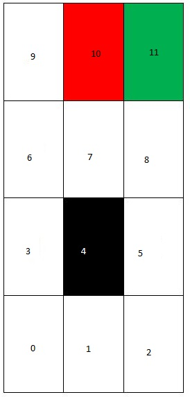

# Grid-problem-using-RL
Suppose that an agent is situated in the 4x3 environment as shown in Figure .  
Beginning in the start state, it must choose an action at each time step.  The interaction with the environment terminates when the agent 
reaches one of the goal states, marked +1 or -1.  We assume that the environment is fully observable, so that the agent always knows where 
it is. Following four actions in every state can be taken:  Up, Down, Left and Right.  However, the environment is stochastic, 
that means the action that you take may not lead you to desired state.  Each action achieves the intended effect with probability 0.8, but 
the rest of the time, the action moves the agent at right angles to the intended direction with equal probabilities.  Furthermore, if the 
agent bumps into a wall, it stays in the same square.  The immediate reward for moving to any state (s) except for the terminal states S+ 
is r(s)= -0.04.  And the reward for moving to terminal states is +1 and -1 respectively.  Find the value function corresponding to the 
optimal policy using value iteration

